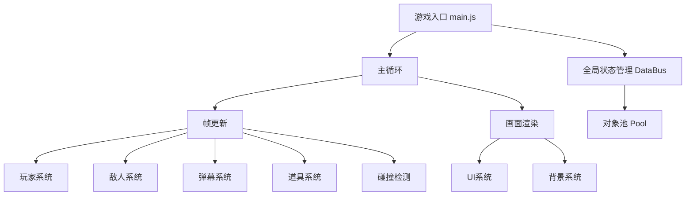

# 《星空入侵者》技术设计文档

## 1. 项目概述
《星空入侵者》是一款基于微信小游戏模板开发的东方风格弹幕射击游戏，采用原生Canvas 2D渲染，面向对象架构，实现了完整的弹幕射击游戏核心玩法，包含玩家系统、敌人系统、弹幕系统、道具系统、升级系统、Boss战等核心功能。

## 2. 系统架构

### 2.1 高层架构图


### 2.2 核心数据流
1. **全局状态管理**：所有游戏状态通过`js/databus.js`单例统一管理，包括实体列表、分数、经验、关卡等数据
2. **主循环**：`js/main.js`是游戏入口，通过`requestAnimationFrame`实现60fps帧循环，每帧依次执行：
   - 更新所有实体状态（背景、玩家、子弹、敌机、弹幕、道具）
   - 生成新敌机
   - 全局碰撞检测
   - 渲染所有元素
3. **对象池**：所有频繁创建销毁的对象（子弹、弹幕、敌机、道具）通过`js/base/pool.js`复用，减少GC

### 2.3 目录结构
```
SkyDefender/
├── js/                     # 主源码目录
│   ├── base/              # 基础类库
│   │   ├── pool.js       # 对象池实现
│   │   ├── sprite.js     # 精灵基类
│   │   └── animation.js # 动画基类
│   ├── bullet/            # 弹幕系统
│   │   └── danmaku.js    # 敌方弹幕实现
│   ├── config/            # 配置文件
│   │   └── level.js      # 关卡与敌人配置
│   ├── npc/               # 非玩家角色
│   │   ├── enemy.js      # 普通敌机
│   │   └── boss.js        # Boss敌机
│   ├── player/            # 玩家相关
│   │   ├── index.js      # 玩家主类
│   │   └── bullet.js     # 玩家子弹
│   ├── prop/              # 道具系统
│   │   └── index.js      # 道具实现与合成
│   ├── runtime/            # 运行时工具
│   │   ├── background.js  # 背景滚动
│   │   ├── gameinfo.js   # UI界面渲染
│   │   └── music.js       # 音效管理
│   ├── libs/              # 第三方库
│   │   └── tinyemitter.js # 事件发射器
│   ├── databus.js         # 全局状态管理
│   ├── render.js          # 画布初始化
│   └── main.js            # 游戏主入口
├── game.js                # 游戏启动入口
└── main.js                # 项目入口
```

## 3. 核心类设计

### 3.1 继承关系
```
Sprite (基础精灵)
├── Animation (帧动画扩展)
│   ├── Enemy (普通敌机)
│   │   └── Boss (Boss敌机，继承Enemy扩展阶段系统)
│   ├── Player (玩家飞机)
│   ├── Danmaku (敌方弹幕)
│   ├── Prop (道具)
│   └── BackGround (背景滚动)
└── Bullet (玩家子弹)
```

### 3.2 核心类详解

#### 3.2.1 Sprite基类 (`js/base/sprite.js`)
所有游戏对象的基类，提供基础的渲染和碰撞检测能力：
- **核心方法**：
  - `render(ctx)`: 基础渲染逻辑
  - `isCollideWith(sp)`: 轴对齐矩形碰撞检测
- **核心属性**：
  - `x/y`: 坐标位置
  - `width/height`: 碰撞尺寸
  - `img`: 渲染纹理
  - `camp`: 阵营（player/enemy/neutral）

#### 3.2.2 Animation类 (`js/base/animation.js`)
继承Sprite，扩展帧动画播放能力：
- **核心方法**：
  - `playAnimation(index, loop)`: 启动指定动画
  - `stopAnimation()`: 停止动画播放
  - `aniRender(ctx)`: 动画帧渲染
- **核心属性**：
  - `aniList`: 动画帧列表
  - `aniInterval`: 动画帧间隔
  - `loop`: 是否循环播放

#### 3.2.3 Pool类 (`js/base/pool.js`)
通用对象池实现，用于复用频繁创建销毁的对象：
- **核心方法**：
  - `getPoolBySign(name)`: 获取指定类型的对象池
  - `getItemByClass(name, className, ...args)`: 从对象池获取或创建对象
  - `recover(name, instance)`: 回收对象到对象池
- **使用场景**：敌机、子弹、弹幕、道具、动画实例

#### 3.2.4 DataBus类 (`js/databus.js`)
全局状态管理单例，集中管理所有游戏数据：
- **核心属性**：
  - 实体列表：`enemys`、`bullets`、`danmakus`、`props`、`animations`
  - 游戏状态：`frame`、`score`、`lives`、`level`、`wave`、`gameState`
  - 全局实例：`pool`对象池实例
- **设计特点**：
  - 单例模式，全局唯一访问点
  - 集中式管理，降低模块耦合
  - 自动对象回收机制

## 4. 核心系统设计

### 4.1 主循环系统
```mermaid
graph TD
    A[Main.loop()] --> B[update()]
    A --> C[render()]
    B --> D[databus.frame++]
    B --> E{游戏状态检查?}
    E -->|非运行状态| F[跳过战斗逻辑]
    E -->|运行状态| G[更新所有游戏实体]
    G --> G1[背景更新]
    G --> G2[玩家更新]
    G --> G3[子弹更新]
    G --> G4[敌机更新]
    G --> G5[弹幕更新]
    G --> G6[道具更新]
    G --> G7[敌机生成逻辑]
    G --> G8[碰撞检测]
    G --> G9[波次完成检查]
    C --> C1[清空画布]
    C --> C2[渲染背景]
    C --> C3[渲染玩家]
    C --> C4[渲染子弹]
    C --> C5[渲染敌机]
    C --> C6[渲染弹幕]
    C --> C7[渲染道具]
    C --> C8[渲染UI]
    C --> C9[渲染动画]
```

### 4.2 玩家系统
- **控制**：通过微信触摸事件实现拖拽移动，支持精密移动模式（右侧区域触发）
- **射击**：基于道具栏的多武器系统，每个武器有独立冷却时间
- **属性**：支持移动速度、射速、伤害、护盾、闪避等多种属性加成
- **状态**：包含爆炸动画、无敌帧、碰撞判定优化（小中心点）
- **核心方法**：
  - `initWeapons()`: 基于道具栏初始化武器系统
  - `shootWeapon(weapon)`: 发射指定类型武器
  - `updatePropsEffect()`: 计算道具属性加成

### 4.3 敌人系统
- **普通敌机**：支持多种移动模式与弹幕类型，基于配置表动态初始化
- **Boss敌机**：多阶段战斗系统，每个阶段有独立移动和攻击模式
- **波次管理**：按配置生成敌人波次，统计杀敌数与波次进度
- **回收机制**：超出屏幕或死亡的敌机自动回收到对象池
- **核心配置**：生命值、碰撞伤害、移动速度、弹幕类型、掉落率、击杀得分、经验值

### 4.4 弹幕系统
- **弹道类型**：支持直线、曲线、螺旋、追踪、扇形、环形等多种弹道
- **性能优化**：全部使用对象池创建，避免频繁GC
- **行为**：支持角度偏移、速度变化、目标追踪等复杂弹幕逻辑
- **阵营区分**：玩家子弹和敌方弹幕分属不同阵营，避免友军伤害

### 4.5 道具系统
- **类型**：分为攻击类、辅助类、合成类共20+种道具
- **合成**：支持多道具合成高阶道具，包含完整的合成配方系统
- **拾取**：支持磁力吸引、自动升级、经验补偿等逻辑
- **UI**：实时显示道具栏与道具等级
- **效果**：提供属性加成、武器升级、护盾、生命恢复等多种效果

### 4.6 UI系统
- **多状态界面**：开始菜单、道具选择、游戏HUD、暂停菜单、升级界面、通关界面
- **信息展示**：分数、生命值、护盾、经验条、Boss血条
- **交互**：触摸事件处理，支持按钮点击与菜单导航
- **渲染层级**：按背景→游戏实体→UI的层级顺序渲染

### 4.7 碰撞检测系统
全局统一碰撞检测逻辑，检测4类碰撞：
1. 玩家子弹 ↔ 敌机
2. 敌方弹幕 ↔ 玩家
3. 敌机 ↔ 玩家
4. 道具 ↔ 玩家
- **实现方式**：轴对齐矩形判定，玩家使用优化的中心点小判定框提升手感
- **伤害逻辑**：根据阵营和对象类型执行不同的伤害处理逻辑

## 5. 配置系统设计

### 5.1 全局常量
```javascript
SCREEN_WIDTH = 窗口宽度
SCREEN_HEIGHT = 窗口高度
BASE_SHOOT_INTERVAL = 20 // 基础射击间隔
ENEMY_GENERATE_INTERVAL = 60 // 敌机生成基础间隔
```

### 5.2 敌机配置
```javascript
ENEMY_CONFIG = {
  hp: 生命值,
  damage: 碰撞伤害,
  speed: 移动速度,
  width/height: 碰撞尺寸,
  dropRate: 道具掉落率,
  shootInterval: 射击间隔,
  bulletType: 弹幕类型,
  score: 击杀得分,
  exp: 击杀经验,
  imgSrc: 资源路径
}
```

### 5.3 Boss配置
```javascript
BOSS_CONFIG = {
  name: Boss名称,
  hp/maxHp: 血量,
  damage: 碰撞伤害,
  speed: 移动速度,
  width/height: 碰撞尺寸,
  phaseCount: 阶段总数,
  phases: [
    {
      hpThreshold: 血量百分比阈值,
      movePattern: 移动模式,
      shootPatterns: 弹幕模式列表,
      shootInterval: 射击间隔
    }
  ]
}
```

### 5.4 关卡配置
包含3个完整关卡，每个关卡包含多个波次，支持普通敌人、精英敌人、Boss敌人混合配置。

## 6. 性能优化设计

### 6.1 对象池优化
所有频繁创建销毁的对象（敌机、子弹、弹幕、道具）通过对象池复用，减少GC开销，提升游戏运行流畅度。

### 6.2 渲染优化
- 按层级批量渲染，减少Canvas状态切换
- 离屏渲染优化（可扩展）
- 不可见对象自动回收到对象池

### 6.3 逻辑优化
- 碰撞检测空间分区（可扩展）
- 实体列表脏标记更新
- 帧数驱动的定时逻辑，避免setTimeout开销

## 7. 开发规范
1. 所有新增实体类继承自`Sprite`或`Animation`基类
2. 频繁创建的对象使用对象池复用，避免直接new实例
3. 全局状态统一通过`GameGlobal.databus`访问
4. 玩家操作只在`Player`类中处理
5. 所有碰撞逻辑统一在`main.js`的`collisionDetection`方法中处理
6. 数值配置尽量抽离为常量，避免硬编码
7. 代码提交前执行`eslint js/**/*.js`进行代码检查

## 8. 部署与发布
### 8.1 开发调试
1. 下载并打开[微信开发者工具](https://developers.weixin.qq.com/miniprogram/dev/devtools/download.html)
2. 导入项目根目录，选择"小游戏"项目类型
3. 工具内直接预览和调试，支持真机预览

### 8.2 构建发布
1. 在微信开发者工具中点击"上传"
2. 填写版本号和项目备注
3. 提交到微信公众平台审核发布
